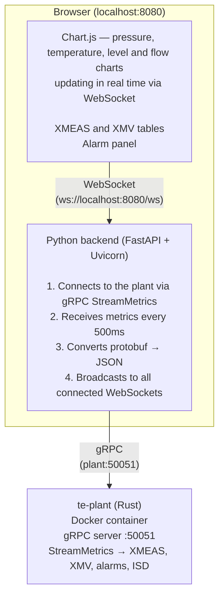

# tep-ihm

HMI (Human-Machine Interface) for the Tennessee Eastman experiment. Web dashboard that displays the plant's state and the supervisory Kubernetes operator's decisions in real time.

## What it does

The HMI connects to two data sources and presents everything in a single web interface:

| Source       | Protocol                  | What it shows                                       |
| ------------ | ------------------------- | --------------------------------------------------- |
| TEP Plant    | gRPC `StreamMetrics`      | 22 XMEAS, 12 XMV, alarms, ISD, simulation time |
| K8s Operator | Kubernetes API (watch)    | Phase, actions taken, configured ranges             |

Today only the plant panel is implemented. The operator panel will be enabled by issue #41, once the supervisory logic is working.

## How it works



### Data flow

1. The backend opens a **gRPC stream** with the plant (`StreamMetrics`). The plant sends a `PlantMetrics` message every 500ms (configurable via `STREAM_INTERVAL_MS`).
2. The backend converts each protobuf message to JSON and broadcasts it via **WebSocket** to all connected browsers.
3. The frontend receives the JSON and updates 4 Chart.js charts (pressure, temperature, levels, flows), current-value tables (XMEAS and XMV), and the alarm panel.
4. If the plant enters **emergency shutdown** (ISD), a red banner appears at the top of the screen.
5. If the gRPC connection drops, the backend retries every 3 seconds. If the WebSocket drops, the frontend retries every 2 seconds.

### Automatic reconnection

Both the backend and the frontend have automatic reconnection. You can start the HMI before the plant — when the plant comes up, the connection is established on its own.

## Stack

| Layer                   | Technology                                      | Why                                                                                                              |
| ------------------------ | ----------------------------------------------- | ----------------------------------------------------------------------------------------------------------------- |
| Backend                 | **FastAPI** (Python)                            | Async framework with native WebSocket support. Lightweight, no boilerplate.                                     |
| ASGI server             | **Uvicorn**                                     | High-performance async server for FastAPI.                                                                       |
| gRPC client             | **grpcio** + stubs generated by **grpcio-tools** | Consumes the plant's `StreamMetrics`. Stubs are generated from the same `.proto` as the plant.                  |
| Serialization           | **Protocol Buffers** (protobuf)                 | Binary format used by the plant. The backend converts it to JSON before sending it to the frontend.             |
| Real-time communication | **WebSocket**                                   | Persistent connection between backend and frontend. More efficient than HTTP polling for data changing every 500ms. |
| Charts                  | **Chart.js 4** (CDN)                            | Lightweight charting library, no build step. Renders directly on the browser canvas.                            |
| Frontend                | **Plain HTML + CSS + JS**                       | No framework (React, Vue, etc). The dashboard is simple enough not to need one.                                 |

## Dependencies

### Runtime

- **Python >= 3.11**
- **TEP plant running** and reachable via gRPC (default: `localhost:50051`)

### Python packages (managed by Poetry)

| Package            | Version | Use                                          |
| ----------------- | ------ | --------------------------------------------- |
| fastapi           | ^0.115 | Async web framework                          |
| uvicorn[standard] | ^0.34  | ASGI server                                   |
| websockets        | ^15.0  | WebSocket implementation for Uvicorn          |
| grpcio            | ^1.72  | gRPC client                                   |
| grpcio-tools      | ^1.72  | Python stub generator from `.proto`          |
| protobuf          | ^6.30  | protobuf runtime                              |

### Dev

| Package | Use                 |
| ------ | -------------------- |
| ruff   | Linter and formatter |

### External (not Python packages)

- **Docker** — to run the plant as a container
- **Proto file** — `proto/tep/v1/plant.proto` copied from the `tep-plant` repo. Stubs in `gen/` are generated from it and are not committed to git.

## Setup

```bash
# 1. Install dependencies
poetry install

# 2. Generate gRPC stubs (required the first time and whenever the proto changes)
poetry run python -m grpc_tools.protoc \
  -I proto \
  --python_out=gen \
  --grpc_python_out=gen \
  proto/tep/v1/plant.proto

# 3. Run (the plant must be reachable on port 50051)
poetry run python src/server.py
```

Visit `http://localhost:8080`

### Environment variables

| Variable              | Default           | Description                             |
| -------------------- | ----------------- | --------------------------------------- |
| `PLANT_ADDRESS`      | `localhost:50051` | Plant's gRPC address                    |
| `STREAM_INTERVAL_MS` | `500`             | Stream sampling interval (ms)           |
| `PORT`               | `8080`            | Dashboard's HTTP port                   |

## Project structure

```
tep-ihm/
├── proto/tep/v1/plant.proto   # gRPC service definition (copied from the plant)
├── gen/                       # Generated Python stubs (gitignored)
├── src/
│   └── server.py              # FastAPI backend + gRPC client + WebSocket
├── static/
│   ├── index.html             # Dashboard HTML
│   ├── app.js                 # Chart and WebSocket logic
│   └── style.css              # Dark theme visuals
├── pyproject.toml             # Dependencies (Poetry)
└── Dockerfile                 # HMI container
```

## Planned improvements

### Short term
- **Dockerfile** — containerize the HMI so it runs alongside the plant and Kind without needing Poetry/Python installed
- **Operator panel** — show phase (Stable/Transient/Alarm), configured ranges, action history. Depends on #41.
- **XMEAS selection** — allow choosing which variables appear on the charts instead of fixed charts

### Medium term
- **Persistent history** — save metrics to SQLite or a file to view history even after a restart
- **Event markers** — show on the chart when the operator took an action (vertical line + annotation)
- **CSV export** — button to export the visible data
- **XMV charts** — add charts for the manipulated variables, not just the measured ones

### Long term
- **Disturbance panel** — show active IDVs on the plant (once exposed via gRPC)
- **Multi-plant** — connect to more than one plant instance at the same time

## Issues

- [#42 — HMI / Dashboard](https://github.com/orgs/Green-Cinnamon-Labs/projects/6/views/1?pane=issue&itemId=167881610&issue=Green-Cinnamon-Labs%7Cspec-tennessee-eastman%7C42)
