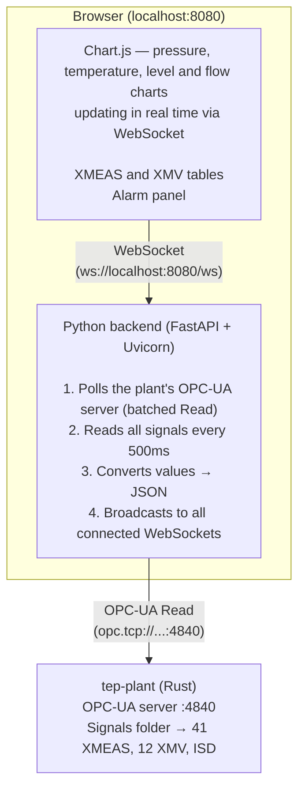

# tep-ihm

HMI (Human-Machine Interface) for the Tennessee Eastman experiment. Web dashboard that displays the plant's state and the supervisory Kubernetes operator's decisions in real time.

## What it does

The HMI connects to two data sources and presents everything in a single web interface:

| Source       | Protocol                  | What it shows                                       |
| ------------ | ------------------------- | --------------------------------------------------- |
| TEP Plant    | OPC-UA (polling `Read`)   | 41 XMEAS, 12 XMV, ISD. No simulation time, alarms, or disturbance control yet — see [Known gaps](#known-gaps) |
| K8s Operator | Kubernetes API (watch)    | Phase, actions taken, configured ranges             |

Today only the plant panel is implemented. The operator panel will be enabled by issue #41, once the supervisory logic is working.

## How it works



### Data flow

1. The backend connects to the plant's **OPC-UA server** (`monjolo::adapter::opcua`), browses the `Signals` folder once to resolve each node, then polls all of them with a single batched `Read` every `STREAM_INTERVAL_MS` (default 500ms).
2. The backend converts the read values to JSON and broadcasts it via **WebSocket** to all connected browsers.
3. The frontend receives the JSON and updates 4 Chart.js charts (pressure, temperature, levels, flows), current-value tables (XMEAS and XMV), and the alarm panel.
4. If the plant enters **emergency shutdown** (ISD), a red banner appears at the top of the screen.
5. If the OPC-UA connection drops, the backend retries every 3 seconds. If the WebSocket drops, the frontend retries every 2 seconds.

### Automatic reconnection

Both the backend and the frontend have automatic reconnection. You can start the HMI before the plant — when the plant comes up, the connection is established on its own.

## Stack

| Layer                   | Technology                                      | Why                                                                                                              |
| ------------------------ | ----------------------------------------------- | ----------------------------------------------------------------------------------------------------------------- |
| Backend                 | **FastAPI** (Python)                            | Async framework with native WebSocket support. Lightweight, no boilerplate.                                     |
| ASGI server             | **Uvicorn**                                     | High-performance async server for FastAPI.                                                                       |
| OPC-UA client           | **asyncua**                                     | Polls the plant's OPC-UA server (`monjolo::adapter::opcua`) — browses the `Signals` folder once, then batched `Read` on a timer. |
| Real-time communication | **WebSocket**                                   | Persistent connection between backend and frontend. More efficient than HTTP polling for data changing every 500ms. |
| Charts                  | **Chart.js 4** (CDN)                            | Lightweight charting library, no build step. Renders directly on the browser canvas.                            |
| Frontend                | **Plain HTML + CSS + JS**                       | No framework (React, Vue, etc). The dashboard is simple enough not to need one.                                 |

## Dependencies

### Runtime

- **Python >= 3.11**
- **TEP plant running** with the `opcua` feature and reachable via OPC-UA (default: `opc.tcp://127.0.0.1:4840/tep/server/`)

### Python packages (managed by Poetry)

| Package            | Version | Use                                          |
| ----------------- | ------ | --------------------------------------------- |
| fastapi           | ^0.115 | Async web framework                          |
| uvicorn[standard] | ^0.34  | ASGI server                                   |
| websockets        | ^15.0  | WebSocket implementation for Uvicorn          |
| asyncua           | ^2.0   | OPC-UA client                                 |

### Dev

| Package | Use                 |
| ------ | -------------------- |
| ruff   | Linter and formatter |

### External (not Python packages)

- **Docker** — to run the plant as a container

## Setup

```bash
# 1. Install dependencies
poetry install

# 2. Run (the plant must be reachable on opc.tcp://127.0.0.1:4840/tep/server/,
#    started with `cargo run --bin tep-plant --features opcua`)
poetry run python src/server.py
```

Visit `http://localhost:8080`

### Environment variables

| Variable              | Default                                    | Description                             |
| -------------------- | ------------------------------------------- | --------------------------------------- |
| `OPCUA_ENDPOINT`     | `opc.tcp://127.0.0.1:4840/tep/server/`      | Plant's OPC-UA endpoint                 |
| `STREAM_INTERVAL_MS` | `500`                                        | Polling interval (ms)                   |
| `PORT`               | `8080`                                       | Dashboard's HTTP port                   |

## Project structure

```
tep-ihm/
├── src/
│   └── server.py              # FastAPI backend + OPC-UA client + WebSocket
├── static/
│   ├── index.html             # Dashboard HTML
│   ├── app.js                 # Chart and WebSocket logic
│   └── style.css              # Dark theme visuals
├── pyproject.toml             # Dependencies (Poetry)
└── Dockerfile                 # HMI container
```

## Known gaps

`monjolo::adapter::opcua` only exposes plant sensors/actuators — it has no concept of simulation
lifecycle or disturbance injection. Until that lands in `tep-plant`, three things are stubbed:

- **Simulation control** (pause/resume/reset) and **speed** — `/simulation/control` and
  `/simulation/speed` accept requests and keep the UI responsive, but no longer reach the plant.
  Tracked in [spec-tennessee-eastman#61](https://github.com/Green-Cinnamon-Labs/spec-tennessee-eastman/issues/61).
- **IDV disturbances** — `/disturbances/*` keep tracking the active set locally (same as CSV replay
  mode always did) but don't apply anything to a real plant anymore.
  Tracked in [spec-tennessee-eastman#62](https://github.com/Green-Cinnamon-Labs/spec-tennessee-eastman/issues/62).
- **Simulated time (`t_h`)** — no OPC-UA node publishes it yet. The dashboard shows `N/A` instead of
  a fabricated value; recording/capture features that need a time axis skip samples until a real
  source exists (tracked in #61 alongside runtime control).

## Planned improvements

### Short term
- **Dockerfile** — containerize the HMI so it runs alongside the plant and Kind without needing Poetry/Python installed
- **Operator panel** — show phase (Stable/Transient/Alarm), configured ranges, action history. Depends on #41.
- **XMEAS selection** — allow choosing which variables appear on the charts instead of fixed charts

### Medium term
- **Persistent history** — save metrics to SQLite or a file to view history even after a restart
- **Event markers** — show on the chart when the operator took an action (vertical line + annotation)
- **CSV export** — button to export the visible data
- **XMV charts** — add charts for the manipulated variables, not just the measured ones

### Long term
- **Disturbance panel** — show active IDVs on the plant (once exposed via OPC-UA, see Known gaps)
- **Multi-plant** — connect to more than one plant instance at the same time

## Issues

- [#42 — HMI / Dashboard](https://github.com/orgs/Green-Cinnamon-Labs/projects/6/views/1?pane=issue&itemId=167881610&issue=Green-Cinnamon-Labs%7Cspec-tennessee-eastman%7C42)
